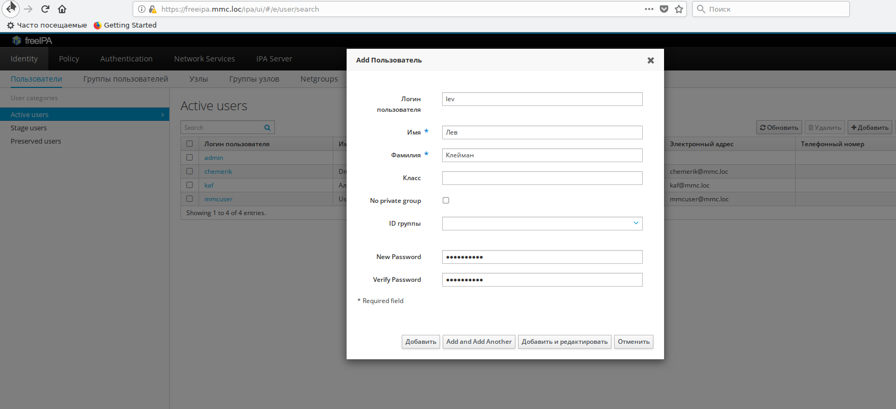
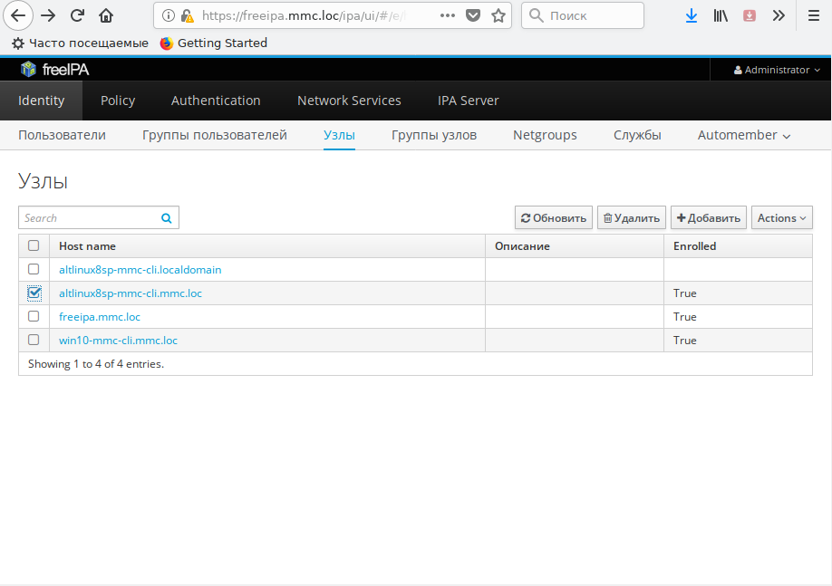
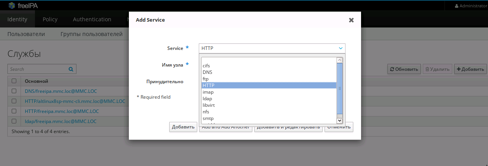
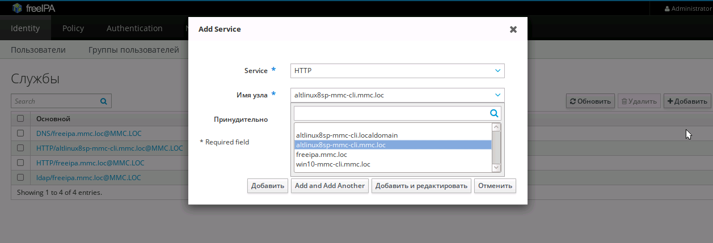
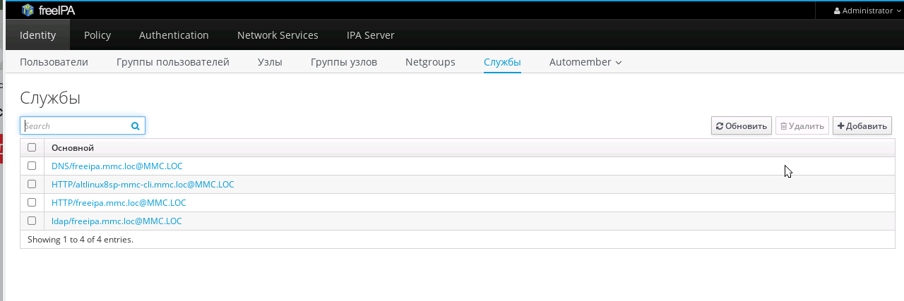

# На данной странице на примере описана процедура включения WEB-сервиса Apache2 в FreeIPA домен в семействе дистрибутивов ALTLinux P8

## Классы пользователей
В системе могуть существовать два класса пользователей:
- локальные пользователи;
- глобальные пользователи включенные в домен.

Локальные пользователи (root) зарегистрированы только одном компьютеры. Как правило они необходимы для выполнения административных или других функций характерных только для данного компьютера. 
Локальные пользователи при регистрации на локальном компьютере не получают kerberos-билет и не могут выполнять функций по управлению доменом.

Глобальные пользователи зарегистрированы в общей сетевой openLDAP-базе и, как правило (если не оговорено иное), могут иметь доступ к любому компьютеру сети. 
Глобальные пользователи после регистрции в домене получают kerberos-билет и могут выполнять функции в рамках домена. 


## Создание пользователей

### Создание локальных пользователей

Локальные пользователи создаются пользователем, имеющим административные права, командами
`adduser <user>`, `passwd <user>`.
Для локального пользователя создается домашний каталог `/home/<user>` и почтовый ящик.
Удаление локального пользователя производится командой
`userdel [-r] <user>`.
При наличии флага `-r` удаляется домашний каталог и почтовый ящик пользователя.

### Создание глобальных пользователей

Глобальных пользоваталей удобнее всего создавать в административном интерфейсе `freeIPA`.

При первоначальном доступе введенный пароль считается устаревшим. Необходимо ввести старый пароль
и задать новый.
Удаление пользователей произвлдится в рамках того же административного интерфейса.

### Получение администратиных прав локальными и глобальными пользователями

Часть административаных функций по настройке доменных сервисов можно выполнять только под глобальными пользователями 
имеющих посоле регистрации kerberos-билет.
Так как на конфигурируемом компьютере, кроме этого, необходимо выполнять админстративные функции с правами суперпользователя (root) для глобальных пользователей, выполняющих административные функции (например пользователь admin) необходимо предоставить возможность получения прав суперпользователя.
Для этого:
- в локальном пользователе получите права суперпользователя командой
```
# su -
```
- Включите глобального пользователя `admin` в локальную группу `whell`.
```bash
# gpasswd -a admin wheel
```
- измените права доступа файла `/ec/sudoers` для возможности его редактирования:
```
# chmod 660 /etc/sudoers
```
- раскоментируйте в файле `/ec/sudoers` строку предоставляющую доступ к правам `root` 
```
WHEEL_USERS ALL=(ALL) NOPASSWD: ALL
```
(если для доступа к административным функциям в целях безопасности необходимо введение пароля удалите клюяевой слово `NOPASSWD`).
- верните права доступа к файлу `/ec/sudoers`:
```
# chmod 400 /etc/sudoers
```
После этого пользователь `admin` на данном компьютере получает возможность вызывать команду `sudo` для выполнения функций суперпользователя:
```bash
$ sudo <команда>
```
или получение доступа к оболочке суперпользователя:
```
$ sudo bash
...
```

## Установка и конфигурирование Apache2-севрера

Для установки сервера apache2 наберите команду:
```bash
# apt-get install apache2
```
Для запуска сервера воспользуйтесь командой:
```bash
# systemctl start httpd2
```
После запуска WEB-сервер при обращении на стандартный HTT_порт 80 предоставляет доступ к документации по ALT8 СП:
[Домшняя страница Apache2-сервера](images/homepage.png)


## Конфигурирование виртуального WEB-хоста

## Настройка доменной авторизации для доступа к WEB-сервису

### Создание сервиса HTTP
Перед созданием сервиса убедитель, что сервер, на котором запускается Apache2-сервис включен в список узлов администативного freeIPA-интерфейса под доменом локальной сети. 

По умолчанию при установке серверу присваивается домен localdomain. После установки необходимо сменить домен localdomain на домен локальной сети (детали у Дмитрия Чемерика).
DNS-сервер после включения узла в домен долженн отвечать на прямый запросы по домену сервера. 
Например:
```bash
$ host altlinux8sp-mmc-cli.mmc.loc
altlinux8sp-mmc-cli.mmc.loc has address 10.120.250.27
```








### Создание keytab-файла
```bash
# ipa-getkeytab -s freeipa.mmc.loc -p HTTP/altlinux8sp-mmc-cli.mmc.loc@MMC.LOC  -k /etc/httpd2/http.keytab
```

### Установка модулей авторизации

### Добавление доменной авторизации в файл конфигурации WEB-сервиса 
